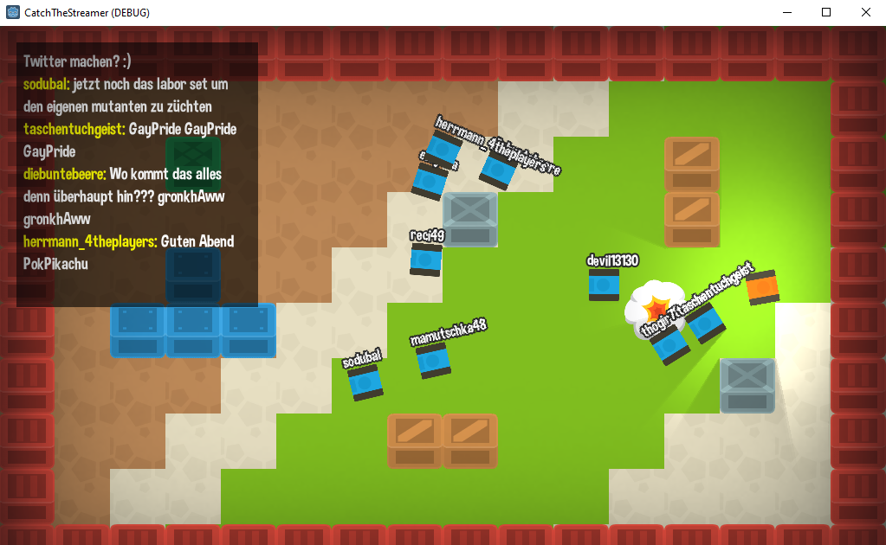

# Catch The Streamer

This game prototype shows how to integrate the Twitch Chat using just GDScript in a game.

The Twitch integration is encapsulated in `TwitchClient.gd`, which can be reused for other projects.

Just change `TWITCH_CHANNEL` in `Game.gd` in order to connect to a different channel. The Twitch Client will emit a signal on every message within the physics process loop.

Within the game, each message will spawn a tank and the streamer needs to avoid collisions with them. He can also shoot them to survive longer.

# Fonts and Assets

## Font

Font used in the game: https://www.dafont.com/de/dimbo.font

## Assets

Assets used in the game: https://kenney.nl/
